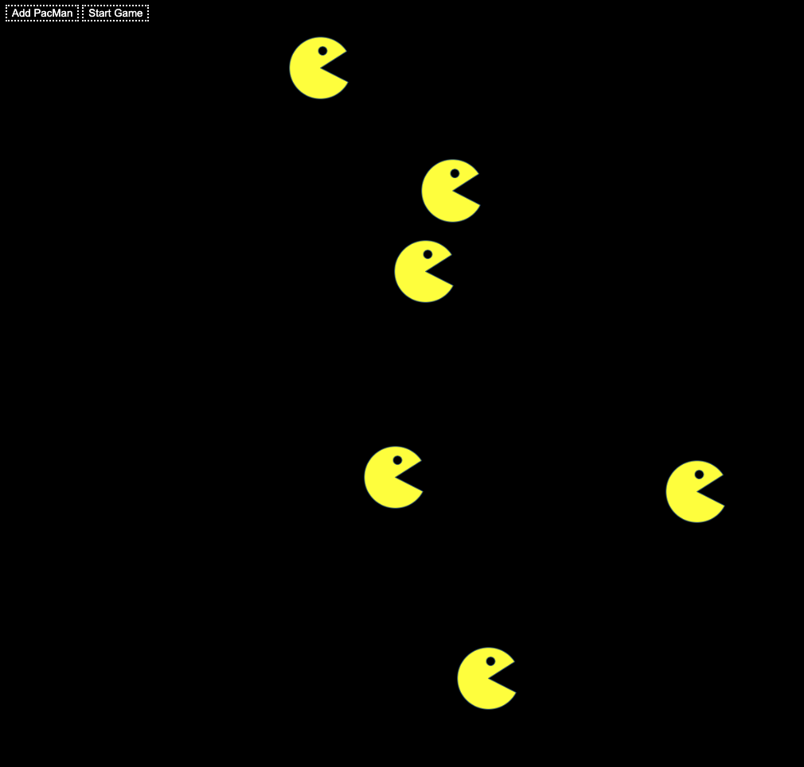

# Pacman
## Exercise on pacman game

Description of the project: In this exercise, we were given starter files to create a web page that produces a PacMan on the click of a button. I added a black background and styled the buttons with a white dash border and white font.

How to Run: This exercise is inteded to run on a web browser. Drag and drop the index.html file onto your browser to view the Pacman Factory. Click the 'Add Pacman' button to add pacman to the page. Click 'Start Game' to see the pacmen bounce around the screen.

Roadmap of future improvements: I would like to introduce new characters to the factory game. For example, adding Pacman fruit and ghosts.

License information: MIT License

Copyright (c) 2022 Ella Taylor

Permission is hereby granted, free of charge, to any person obtaining a copy
of this software and associated documentation files (the "Software"), to deal
in the Software without restriction, including without limitation the rights
to use, copy, modify, merge, publish, distribute, sublicense, and/or sell
copies of the Software, and to permit persons to whom the Software is
furnished to do so, subject to the following conditions:

The above copyright notice and this permission notice shall be included in all
copies or substantial portions of the Software.

THE SOFTWARE IS PROVIDED "AS IS", WITHOUT WARRANTY OF ANY KIND, EXPRESS OR
IMPLIED, INCLUDING BUT NOT LIMITED TO THE WARRANTIES OF MERCHANTABILITY,
FITNESS FOR A PARTICULAR PURPOSE AND NONINFRINGEMENT. IN NO EVENT SHALL THE
AUTHORS OR COPYRIGHT HOLDERS BE LIABLE FOR ANY CLAIM, DAMAGES OR OTHER
LIABILITY, WHETHER IN AN ACTION OF CONTRACT, TORT OR OTHERWISE, ARISING FROM,
OUT OF OR IN CONNECTION WITH THE SOFTWARE OR THE USE OR OTHER DEALINGS IN THE
SOFTWARE.
